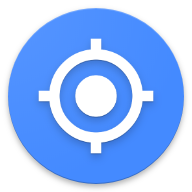
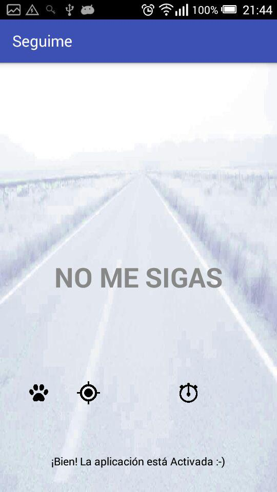
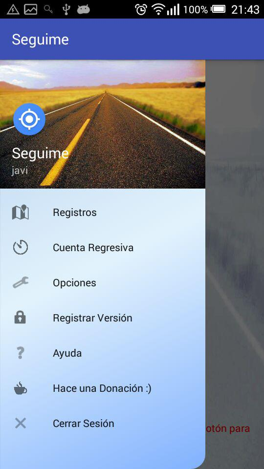
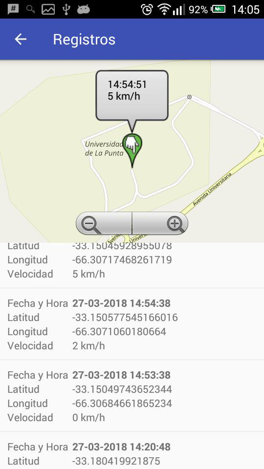
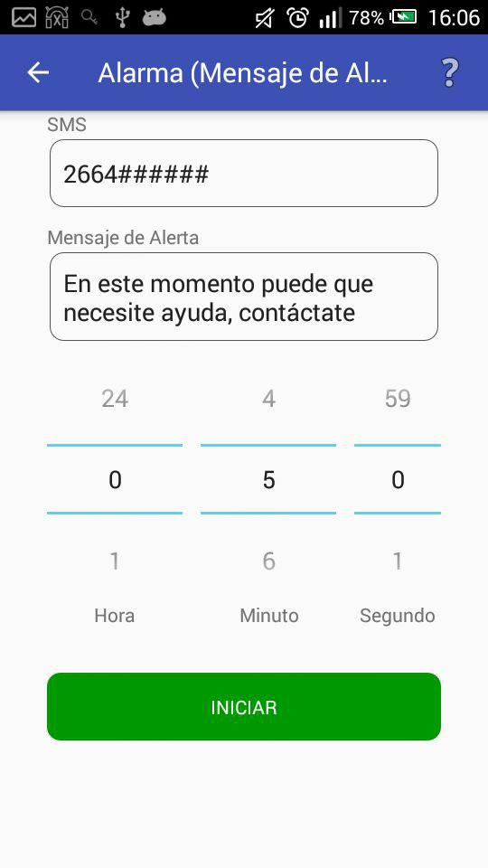
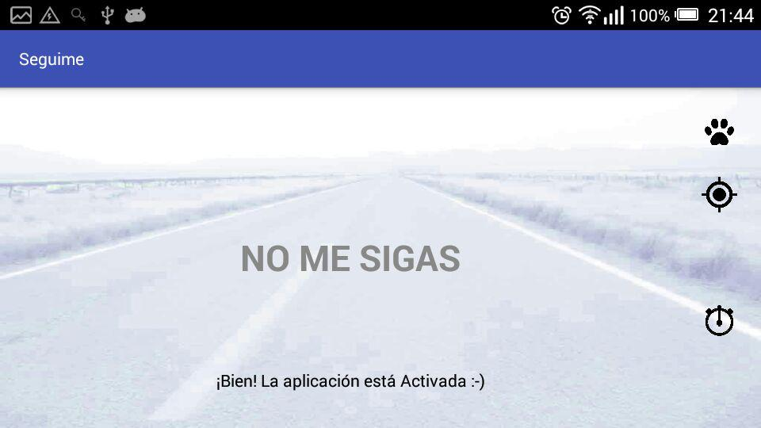
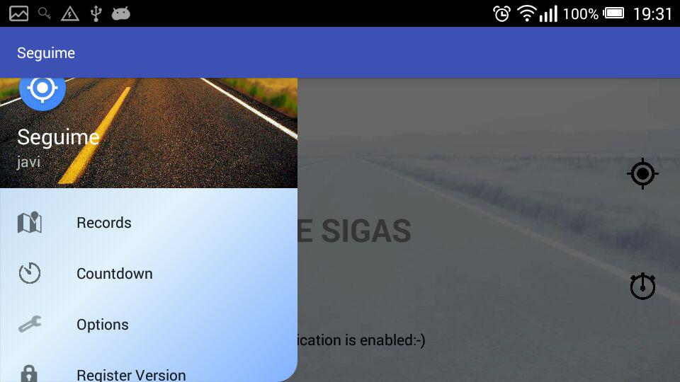
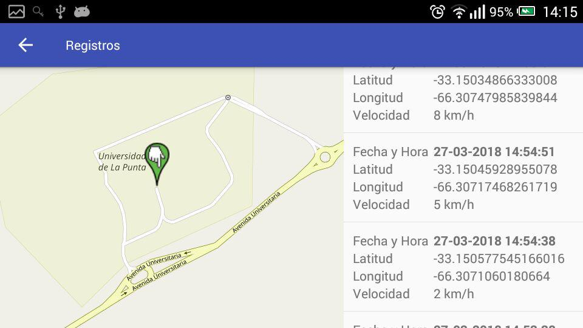
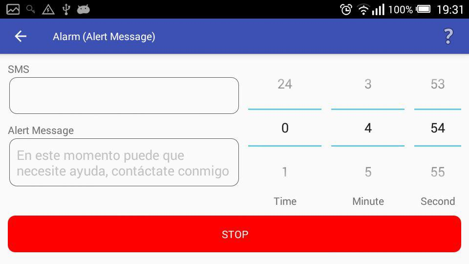

#  Seguime

Almacena coordenadas GPS y las envía a tu servidor web para poder ver donde
está tu dispositivo.

## Características:
* Podes montar tu propio servidor (Mayor privacidad).
* Envía coordenadas por Telegram (Bot) y SMS.
* Configurable desde el sitio web.
* Control sobre tiempos de actividad e inactividad para ahorrar batería.
* Temporizador para habilitar el modo de rastreo y envío de mensajes de emergencia.
* Opción para iniciar con el sistema.
* Opción para bloquear la aplicación.
* Envío de información sobre la red a la que está conectado el dispositivo.
* Cuentas fáciles de crear sin solicitar datos personales.
* Conecta a redes abiertas (Requiere versión completa y la aplicación WiFi Automagico).

Es solo un proyecto, por lo tanto solo podrá usarse con fines experimentales y
no con fines de seguridad.

## Capturas

## Donaciones

Seguime es un proyecto para localizar un dispositivo con sistema operativo Android 

* Libre de Publicidad.
* Libre de Rastreadores.
* Libre de Telemetría.
* Libre de Código Propietario.
* Libre...

Al no tener publicidad este proyecto se mantiene únicamente con donaciones.

Realiza una [Donación](https://javim.000webhostapp.com/donacion) 

## Más información

Si querés más información sobre el proyecto [Visita la Sección de Ayuda](https://seguime.000webhostapp.com/ayuda.php) en el sitio web.
Si querés más aplicaciones [Visita mi sitio web](https://javim.000webhostapp.com) .

