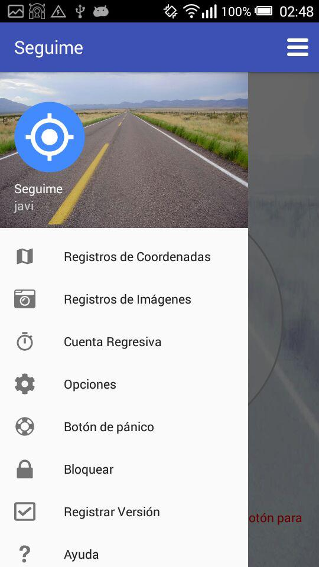

#  Seguime

Almacena coordenadas GPS y las envía a un servidor web y así poder ver donde
esta el dispositivo.

* Podes montar tu propio servidor (Mayor privacidad).
* Envía coordenadas por Telegram (Bot) y SMS.
* Configurable desde el sitio web.
* Control sobre tiempos de actividad e inactividad para ahorrar batería.
* Temporizador para habilitar el modo de rastreo.
* Opción para iniciar con el sistema
* Cuentas fáciles de crear sin solicitar datos personales.

Es solo un proyecto, por lo tanto solo podrá usarse con fines experimentales y
no con fines de seguridad.

# Donaciones

Seguime es un proyecto para localizar un dispositivo con sistema operativo Android 

* Libre de Publicidad
* Libre de Rastreadores
* Libre de Telemetría
* Libre de Código Propietario
* Libre...

Al no tener publicidad este proyecto se mantiene únicamente con donaciones

# Mas información

Si querés más información sobre este proyecto [Visita la Sección de Ayuda](https://seguime.000webhostapp.com/ayuda.php) en el sitio web.
Si querés más aplicaciones [Visita mi sitio web](https://javim.000webhostapp.com) .